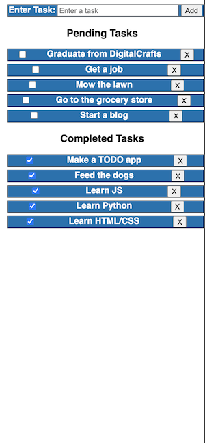

TodoList is an javascript/css assignment with the goal of creating a todo list website. This website must allow you to create a task and have the ability to mark it as completed or remove it entirely.

My final product is responsive to screens of all sizes. My next step is adding the ability to sort pending tasks using drag and drop.

An example of resulting todo list from iPhone X:

